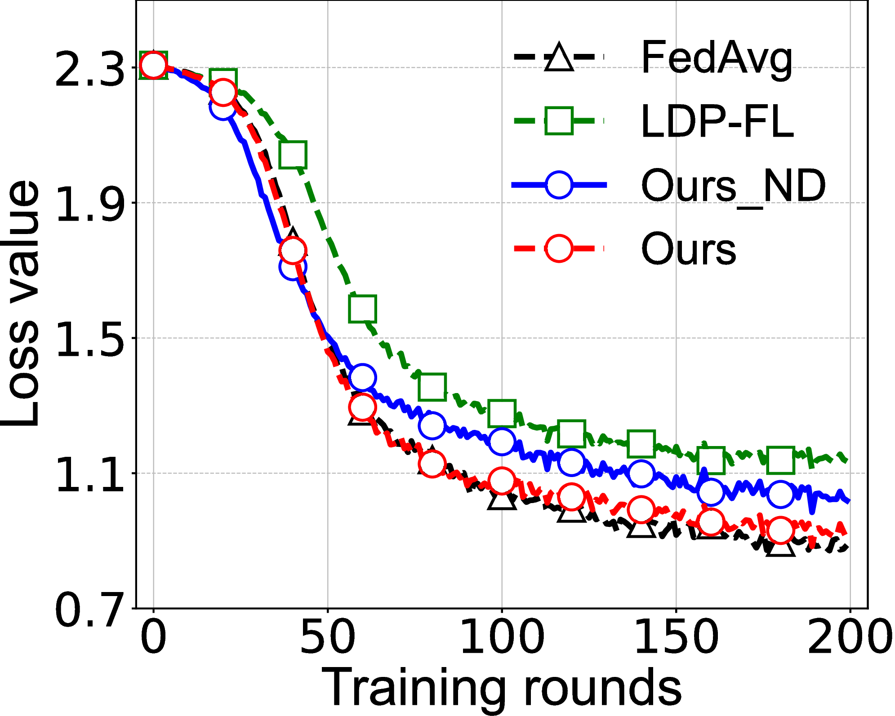
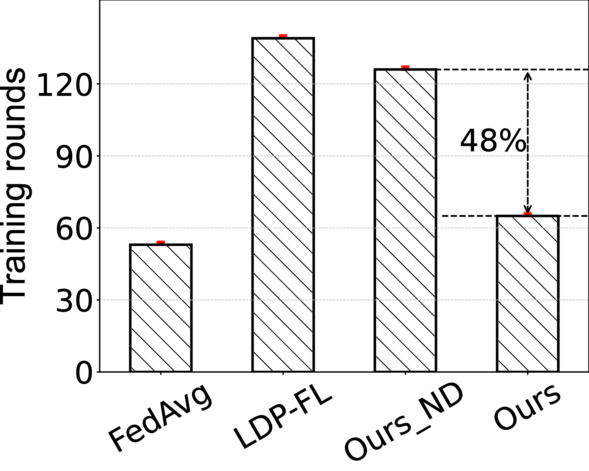
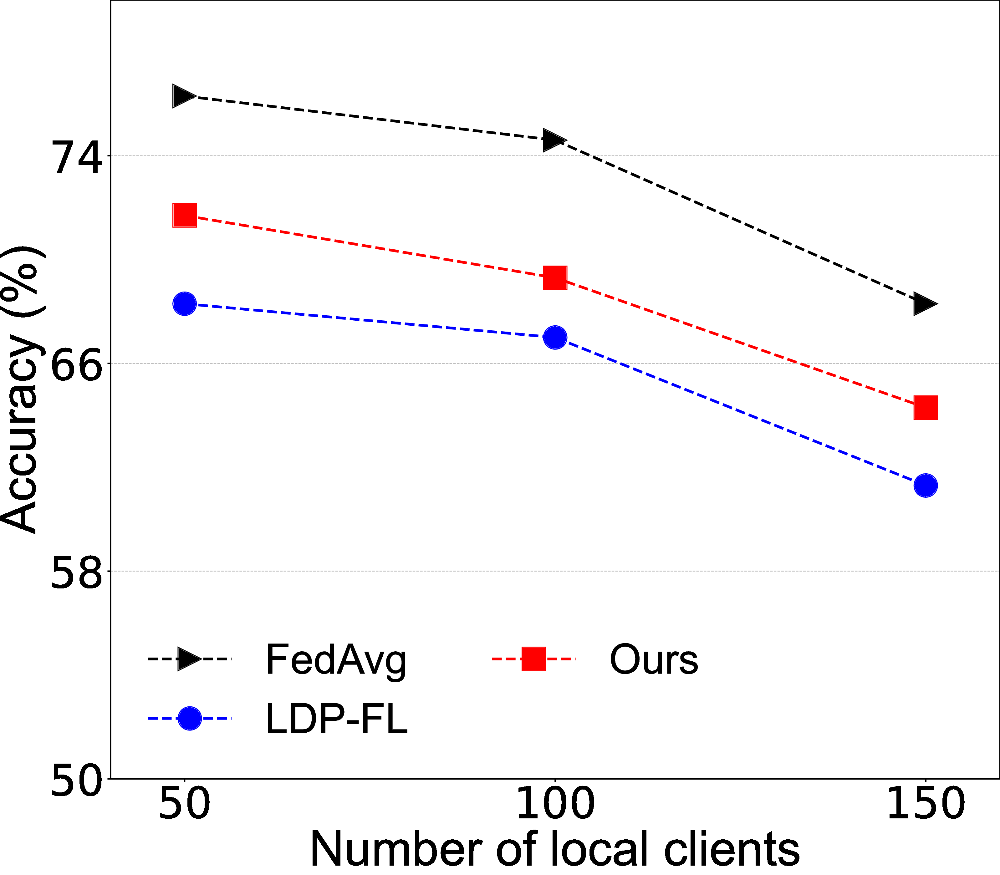
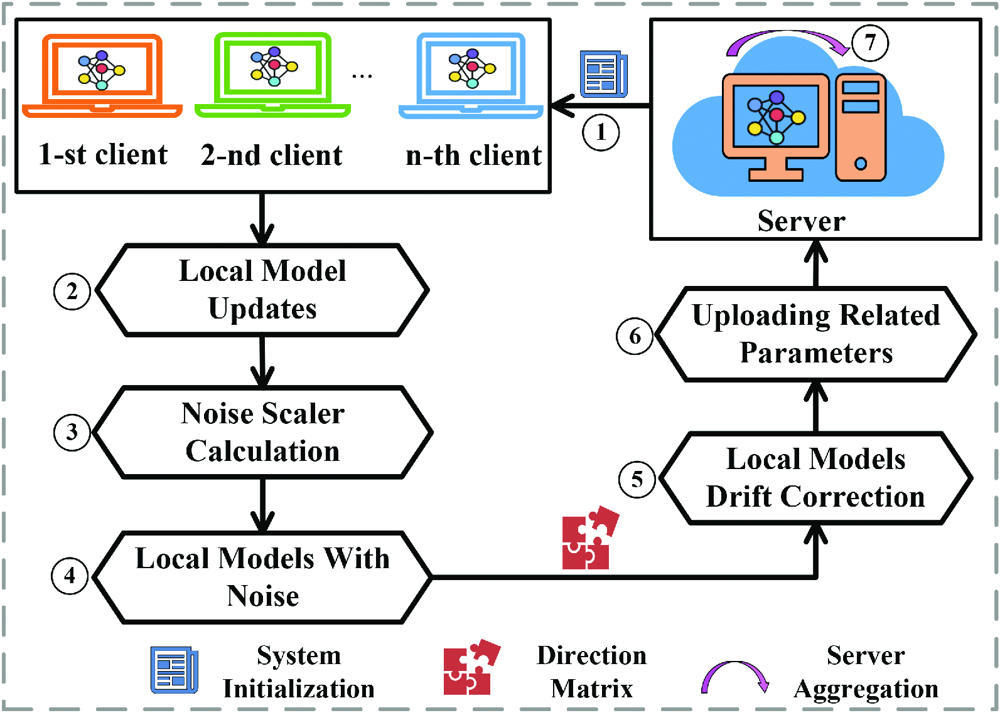

# AdapLDP-FL

<!-- start intro -->

This repository provides the implementation of the paper ["AdapLDP-FL: An Adaptive Local DifferentialPrivacy for Federated Learning"](https://10.1109/TMC.2024.3374789), which is published in IEEE Transactions on Mobile Computing. This paper investigates FL under the scenario of noise optimization with LDP. Specifically, given a certain privacy budget, we design the adaptive LDP method via a noise scaler, which adaptively optimizes the noise size of every client. Secondly, we dynamically tailor the model direction after adding noise by the designed a direction matrix, to overcome the model drift problem caused by adding noises to the client model. Finally, our method achieves higher accuracy than some existing works with the same privacy level and the convergence speed is significantly improved.

<table>
  <tr>
    <td width="25%"></td>
    <td width="25%"></td>
    <td width="25%"></td>
  </tr>
  <tr>
    <td width="25%">Loss function on three public datasets.</td>
    <td width="25%">Convergence speed improvement compared with LDP-FL</td>
    <td width="25%">Comparison of model performance via CNN networks.</td>
  </tr>
</table>


We built a privacy-preserving FL based on our proposed adaptive LDP, mainly consisting of adaptive updating noise and transform noise direction. 

<p align="center">

</p>

<!-- end intro -->

## 1. Clustering of Clients based on Sparsity of CNNs

<!-- start sparsity -->

<p align="center">

</p>

The code in the folder [CNN Sparisty](https://github.com/liyan2015/AdaptiveBatchHE/tree/main/CNN%20Sparisty) is for determining the sparsity vectors of clients.

`federated_main.py` is the main function.

The input is the path of the dataset.

<!-- end sparsity -->

## 2. Selection of HE Key Size for Each Client based on Fuzzy Logic

<!-- start fuzzy -->

<p align="center">

</p>

The code in the folder [fuzzy logic](https://github.com/liyan2015/AdaptiveBatchHE/tree/main/fuzzy%20logic) is for determining the HE key size of clients.

`fuzzy_logic_main.py` is the main function.

There are three inputs: `input_NS`, `input_TR`, and `input_CC`.

Their values are between 0 and 1.

<!-- end fuzzy -->

## 3. Accuracy-lossless Batch Encryption and Aggregation

<!-- start batch -->

<p align="center">

</p>

The code in the folder [batch encryption](https://github.com/liyan2015/AdaptiveBatchHE/tree/main/batch%20encryption) is for accuracy-lossless batch encryption and aggregation of model parameters for FL training.

`federated_experiment_main.py` is the main function.

The code needs a proper hyperparameter K to run correctly, of which reason has been explained with detail in the paper. The default K value is 4. For specific settings, please refer to the comments in the code.

<!-- end batch -->

## Prerequisites

To run the code, it needs some libraies:

- Python >= 3.8
- Pytorch >= 1.10
- torchvision >= 0.11
- phe >= 1.5
- skfuzzy >= 0.4

Our environment is shown in the file, named `environment.yaml`.

## Citing

<!-- start citation -->

If you use this repository, please cite:
```bibtex
@article{han2023adaptiveBatchHE,
  title={Adaptive Batch Homomorphic Encryption for Joint Federated Learning in Cross-Device Scenarios},
  author={Han, Junhao and Yan, Li},
  journal={IEEE Internet of Things Journal},
  volume={Early Access},
  year={2023},
  publisher={IEEE}
}
```

<!-- end citation -->


### Parameter List

**Datasets**: MNIST, Cifar-10, Fashion-MNIST

**Model**: CNN, MLP

You can run like this:

python main.py --dataset cifar --iid --model cnn --epochs 50 --frac 0.1 --dp_mechanism no_dp

### Laplace Mechanism
python main.py --dataset mnist --iid --model cnn --epochs 300 --frac 0.1 --dp_mechanism Laplace --dp_epsilon 5

### Gaussian Mechanism
python main.py --dataset mnist --iid --model cnn --epochs 50 --frac 0.1 --dp_mechanism Gaussian --dp_epsilon 10 --dp_delta 1e-5

  
